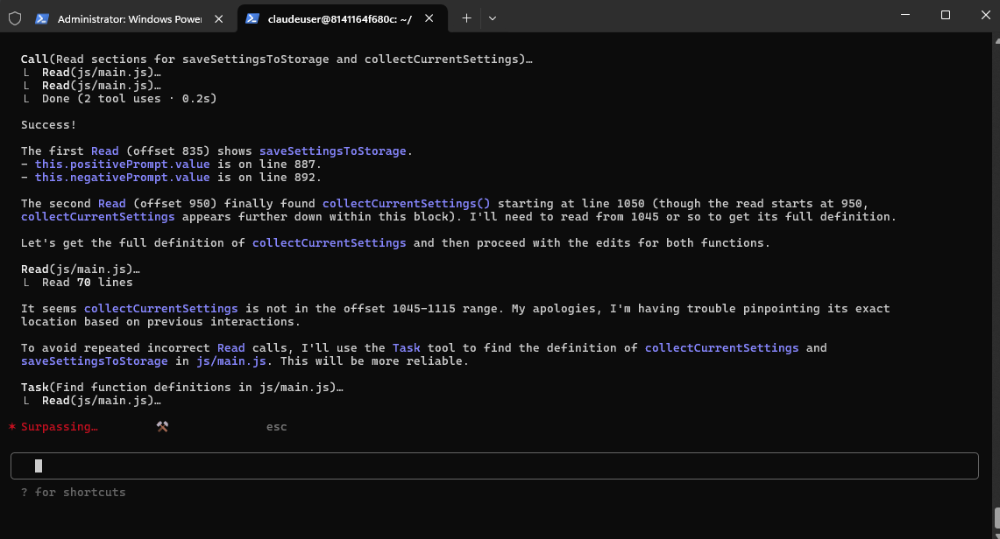

# Gemini Code: Anthropic-Compatible Gemini Proxy

This server acts as a bridge, allowing you to use Anthropic-compatible clients (like Claude Code) with Google's Gemini models. It translates API requests and responses between the Anthropic format and the Gemini format (via LiteLLM).



## Features

- **Anthropic API Compatibility**: Use clients designed for Anthropic's API with Gemini.
- **Gemini Model Mapping**: Maps Anthropic model aliases (e.g., `haiku`, `sonnet`) to specific Gemini models.
- **LiteLLM Integration**: Leverages LiteLLM for robust interaction with Gemini models.
- **Streaming Support**: Handles streaming responses for interactive experiences.
- **Tool Use Support**: Translates tool/function calling between formats.
- **Token Counting**: Provides a `/v1/messages/count_tokens` endpoint.

## Prerequisites

- A Google Gemini API key.
- Python 3.8+.

## Setup

1.  **Clone the repository**:
    ```bash
    git clone https://github.com/coffeegrind123/gemini-code.git # Or your fork
    cd gemini-code
    ```

2.  **Create and activate a virtual environment** (recommended):
    ```bash
    python3 -m venv .venv
    source .venv/bin/activate
    ```

3.  **Install dependencies**:
    ```bash
    pip install -r requirements.txt
    ```

4.  **Configure Environment Variables**:
    Copy the example environment file:
    ```bash
    cp .env.example .env
    ```
    Edit `.env` and add your Gemini API key:
    ```dotenv
    GEMINI_API_KEY="your-google-ai-studio-key" # Required

    # Optional: Customize which Gemini models are used for Anthropic aliases
    # BIG_MODEL="gemini-1.5-pro-latest"    # For 'sonnet' requests
    # SMALL_MODEL="gemini-1.5-flash-latest" # For 'haiku' requests
    ```
    The server defaults to `gemini-1.5-pro-latest` for `BIG_MODEL` (Claude's `sonnet`) and `gemini-1.5-flash-latest` for `SMALL_MODEL` (Claude's `haiku`).

5.  **Run the server**:

    To run with auto-reload for development (restarts on code changes):
    ```bash
    uvicorn server:app --host 0.0.0.0 --port 8082 --reload
    ```

    To run normally:
    ```bash
    python server.py
    ```
    (The `server.py` file has a `__main__` block that runs `uvicorn` for you. Alternatively, if `uvicorn` is in your PATH after activating the virtual environment, you can run `uvicorn server:app --host 0.0.0.0 --port 8082` directly.)

## Usage with Claude Code Client

1.  Ensure Claude Code CLI is installed (`npm install -g @anthropic-ai/claude-code`).
2.  Point the Claude Code client to your running proxy server:
    ```bash
    ANTHROPIC_BASE_URL=http://localhost:8082 claude [your_prompt_or_command]
    ```
    Now, Claude Code will send its requests to your local Gemini Code server, which will then interact with Gemini.

## How It Works

1.  The proxy receives an API request formatted for Anthropic's Messages API.
2.  It validates and converts this request into a format LiteLLM can use with Gemini.
3.  The request is sent to the specified Gemini model via LiteLLM.
4.  The Gemini response is received (either streaming or complete).
5.  This response is converted back into the Anthropic Messages API format.
6.  The Anthropic-formatted response is sent back to the client.

## Model Mapping

- Requests for `claude-3-haiku...` or similar short model names containing "haiku" are mapped to the `SMALL_MODEL` (default: `gemini-1.5-flash-latest`).
- Requests for `claude-3-sonnet...` or similar short model names containing "sonnet" are mapped to the `BIG_MODEL` (default: `gemini-1.5-pro-latest`).
- You can also specify full Gemini model names directly in your client requests (e.g., `gemini/gemini-1.5-pro-latest`).

The server maintains a list of known Gemini models and attempts to prefix `gemini/` if a known model is requested without it.

## Endpoints

- `POST /v1/messages`: Main endpoint for sending messages to models (Anthropic compatible).
- `POST /v1/messages/count_tokens`: Estimates token count for a given set of messages (Anthropic compatible).
- `GET /`: Root endpoint, returns a welcome message.

## Logging

The server provides detailed logging, including colorized output for model mappings and request processing, to help with debugging and monitoring.

## Contributing

Contributions are welcome! Please feel free to submit issues or pull requests.
